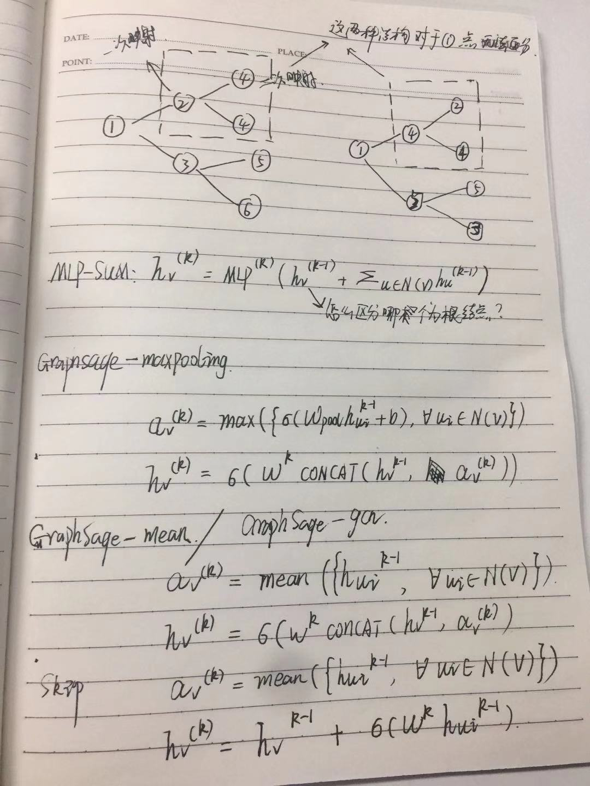

- **HOW POWERFUL ARE GRAPH NEURAL NETWORKS (ICLR 2019)**
  - Keyulu Xu, Weihua Hu, [Jure Leskovec], Stefanie Jegelka
  - [Openreview](https://openreview.net/forum?id=ryGs6iA5Km)

  这个paper从theory的角度证明了节点特征在聚合的时候，mean, max pooling的方式的区别和作用。

  https://openreview.net/forum?id=ryGs6iA5Km

1. Graphsage，先aggregate点a所有相邻点，然后通过combine点a的特征和aggregate得到的feature，作为点a新的特征。具体aggregate部分为对所有特征先做一层MLP，然后max-pooling操作，拼接部分为先进行拼接，然后做先行映射； GCN两步合为一步，直接对点a所有相邻点的特征经过一层MLP，然后对所有特征进行求平均； GIN的操作和GCN更为相似，对点a所有相邻点的特征经过一层MLP，然后对所有特征进行求和。

2. injective的定义为单射，设f是由集合A到集合B的映射，如果所有x,y∈A,且x≠y，都有f(x)≠f(y),则称f为由A到B的单射

3. The mean aggregator 捕捉了统计分布信息，而不是精确的结构。如果点的特征很少有重复的，mean和sum的效果应该相近。

4. the max pooling操作捕捉的既不是分布，也不是精确结构，而是把multipleset当作一个普通的sets，前边允许集合内有重复点，后者不允许有重复的点。这着重于发现最重要的点，而不是捕捉到图的结构。

  缺点：实验部分没有针对数据集，说明max pooling和mean对那种数据集适应的最好，即没有实验证明3和4点。

  另外考虑到本文提出的模型的基本aggregator的操作为：

  
  我认为这样的一个操作，直接把一个根节点和其相邻的点的特征加和在一起，没有考虑到哪个是根节点，哪些是相邻的点。所以针对如下的情况则会出现问题，方框内的两个multisets的结构不同，但是他们两个经过MLP映射，仍然会得到相同的embedding。考虑的解决办法是short connection？

  
